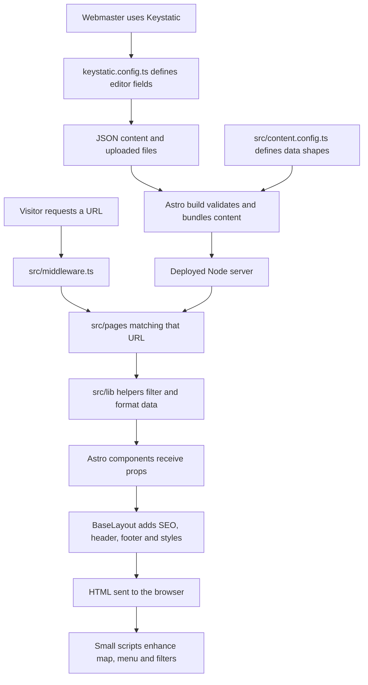

# Developer guide

This guide is for students and junior developers who know some HTML, CSS, and JavaScript. Read it once from top to bottom, then use the file tables and recipes while working. Routine organization updates belong in Keystatic; source changes are for layout, behavior, validation, and new features.

## 1. Start the project

Install Node.js 24, including npm, and use an editor that supports TypeScript and Astro. The official Astro extension for VS Code is helpful. `.nvmrc` records Node 24 for developers who use a Node version manager; installing a version manager is optional.

Open the folder containing `package.json` in your editor, then open its terminal:

```sh
npm ci
npm run dev
```

`npm ci` installs the exact dependency tree recorded in `package-lock.json`. It recreates `node_modules/`, which is intentionally absent from the handoff and excluded from version control. Use it again after pulling dependency changes. Use `npm install` when intentionally adding or updating a dependency, and commit the resulting manifest and lockfile together.

`package.json` also pins an `allowScripts` approval for esbuild's installer, used by newer npm versions. If a dependency upgrade reports a new install script, review it with your teammate before updating that approval. Older npm versions may not expose this approval command; keep the standard install instructions unless you are intentionally updating the toolchain.

Open `http://127.0.0.1:4321/` for the website and `/keystatic/` for the editor. Local editing needs no `.env` or GitHub login. On the bundled Astro version, the development server may run in the background. Stop it with `npx astro dev stop`; if your terminal is running it in the foreground, Ctrl+C stops that process. Check `npx astro dev status` when a port appears occupied.

## 2. What the main technologies do

| Part                | Its job here                                                                     |
| ------------------- | -------------------------------------------------------------------------------- |
| Astro               | Turns components and content into HTML; routes requests to pages.                |
| TypeScript          | Checks assumptions about props, content fields, and browser elements.            |
| Content Collections | Loads the JSON files and validates their shape before the site uses them.        |
| Keystatic           | Gives webmasters forms for editing those JSON files and uploading assets.        |
| Node adapter        | Runs the production server, including Keystatic's API and server-rendered pages. |
| React               | Runs Keystatic's editor. Public pages use Astro and small browser scripts.       |
| GitHub              | Stores source and content history; production CMS saves create commits.          |

There is no separate content database. Images, public downloads, and content files belong in the repository. Production content is bundled during the build. A deployed page can decide whether a notice has expired today, but it cannot see a new GitHub content edit until the host rebuilds and deploys it.

## 3. Folder structure

```text
Kateri/
├── src/
│   ├── pages/                  Website URLs and page composition
│   │   ├── index.astro         Homepage
│   │   ├── announcements/
│   │   │   ├── index.astro     Current notices and archive
│   │   │   └── [slug].astro    One announcement, selected by its URL
│   │   ├── resources/index.astro
│   │   ├── privacy.astro
│   │   └── 404.astro
│   ├── layouts/BaseLayout.astro
│   ├── components/             Reusable pieces and homepage sections
│   ├── content/                JSON: announcements, resources, chapters,
│   │                           leadership, and settings/site.json
│   ├── content.config.ts       Collection loaders and validation schemas
│   ├── assets/images/          Images processed by Astro
│   ├── data/                   Redirect map and local Ontario outline
│   ├── lib/                    Shared content and announcement helpers
│   ├── styles/                 Global design system and font declarations
│   └── middleware.ts           Redirects, admin protection, headers, gzip
├── public/                     Files served at their existing paths
│   ├── fonts/                  Self-hosted fonts and licenses
│   ├── icons/                  Browser and Apple icons
│   ├── uploads/                Public documents and forms
│   └── robots.txt
├── scripts/                    Content validation and map regeneration
├── tests/                      Announcement behavior tests
├── docs/                       Developer, migration, and handoff guides
├── .github/                    Verification workflow and PR template
├── keystatic.config.ts         Editor forms, uploads, and storage mode
├── astro.config.mjs            Integrations, canonical site, build/server setup
├── package.json                Commands and dependency requirements
└── package-lock.json           Exact installed dependency versions
```

`node_modules/`, `.astro/`, and `dist/` are generated. Do not edit or commit them. Changes to `dist/` disappear on the next build. Files beginning with a dot are configuration files, not disposable clutter.

## 4. How the pieces connect



In local mode, the editor writes to your working folder. Review those changed files before committing. In production GitHub mode, saving writes a GitHub commit. A hosting integration must react to that commit, build the project, and replace the deployed application. The GitHub verification workflow alone does not deploy it.

### Follow one chapter from editor to screen

1. `keystatic.config.ts` defines the name, city, parish, coordinates, and links shown in the chapter editor.
2. Saving a chapter updates a file such as `src/content/chapters/ane-thanh.json`. Its filename is the entry ID.
3. The `chapters` collection in `src/content.config.ts` loads that file and checks the field types.
4. `src/pages/index.astro` calls `getCollection("chapters")`, sorts entries with `byOrder`, and passes them to `Chapters.astro`.
5. `Chapters.astro` renders the list and passes the same entries to `ChapterMap.astro`. Neither component has a separate copy of the chapter name or parish.
6. The map's browser script changes which already-rendered detail panel is visible. It does not fetch data from GitHub or an external map service.

## 5. Reading an Astro file

An `.astro` file combines a server-side setup block, an HTML-like template, and optional styles or browser code:

```astro
---
interface Props { message: string }
const { message } = Astro.props;
---

<p class="greeting">{message}</p>

<style>
  .greeting { color: var(--primary); }
</style>
```

The code between `---` markers runs while Astro renders the component, not in the visitor's browser. Props are values supplied by its parent, such as `<Greeting message="Welcome" />`. Braces insert values into the template; `.map()` renders repeated items; `condition && (...)` renders optional content. Ordinary text interpolation escapes HTML, which is why announcement descriptions cannot execute scripts.

A normal `<script>` block contains browser behavior and can use `document`, events, and DOM elements. It cannot directly use a frontmatter variable; pass the required value through markup, such as a `data-*` attribute. A component does not become a React app merely because it uses braces.

`BaseLayout.astro` provides the document wrapper. Its `<slot />` is where the page's content is inserted. It loads global CSS, gets site settings, renders SEO metadata, and includes the shared header and footer.

## 6. Which file should I change?

| Change                                             | Start here                                                              |
| -------------------------------------------------- | ----------------------------------------------------------------------- |
| Organization copy, contact details, photos         | Keystatic → Site settings; stored in `src/content/settings/site.json`   |
| Announcement, resource, chapter, or leader         | Keystatic collection; stored in the corresponding `src/content/` folder |
| Homepage section order or which collections appear | `src/pages/index.astro`                                                 |
| Hero layout or calls to action                     | `src/components/Hero.astro`                                             |
| Header menu labels, links, or mobile behavior      | `src/components/Header.astro`                                           |
| About section                                      | `src/components/About.astro`                                            |
| Featured announcement layout                       | `src/components/FeaturedAnnouncement.astro`                             |
| Announcement cards and attachment links            | `AnnouncementCard.astro` and `Downloads.astro`                          |
| Announcement detail layout                         | `src/pages/announcements/[slug].astro`                                  |
| Chapter list and Map/List buttons                  | `src/components/Chapters.astro`                                         |
| Map markers, details, and interaction              | `src/components/ChapterMap.astro`                                       |
| Leadership section                                 | `src/components/Leadership.astro`                                       |
| Resource rows and filtering                        | `ResourceRow.astro` and `src/pages/resources/index.astro`               |
| Contact section                                    | `src/pages/index.astro`; editable text comes from Site settings         |
| Footer                                             | `src/components/Footer.astro`                                           |
| Site-wide colors, spacing, typography, breakpoints | `src/styles/global.css`                                                 |
| Date, expiry, and registration rules               | `src/lib/announcements.mjs` and `tests/announcements.test.mjs`          |
| Search/social metadata                             | `src/components/SEO.astro`, page props, and Site settings               |
| An old URL's replacement                           | `src/data/redirects.json`                                               |

## 7. Changing content fields safely

There are two schemas for different jobs. `keystatic.config.ts` describes the editing form. `src/content.config.ts` describes the data Astro accepts. Editing only one can make the CMS and website disagree.

For example, to add an optional chapter meeting note:

1. Add `meetingNote: text("Meeting note", true)` to the chapter editor schema in `keystatic.config.ts`.
2. Add `meetingNote: optionalText` to the chapter collection schema in `src/content.config.ts`. The existing `optionalText` helper accepts missing or empty values, so older entries still load.
3. Render it conditionally where needed: `{data.meetingNote && <p>{data.meetingNote}</p>}`. Add it to both the list and map detail if visitors need it in both places.
4. Enter sample content locally through Keystatic and check both views. Keep the field empty on at least one entry while testing the fallback.
5. Run the checks, then commit the schema, presentation, and intended content changes together. Remove any temporary sample entry.

This is an example recipe, not a field already included in the project. If making a new field required, supply valid values in every existing JSON entry in the same change. Do not add a required schema and plan to fix production content later.

JSON uses double quotes and does not allow comments or trailing commas. CMS notes are ordinary data: they are not rendered publicly, but remain visible to anyone who can read the repository.

### Announcement rules

Dates are `YYYY-MM-DD` calendar dates. `ontarioToday()` uses `America/Toronto`, including daylight saving. A current item is active, has reached its publication date, and has not passed its expiry/event date. An expiry or registration deadline remains inclusive through that date.

`expires` takes priority over `eventEnd`, then `eventStart`. Validation prevents a completed event being extended past its event end; use a separate follow-up notice instead. Featured notices sort ahead of other current notices, then newest first. Future publications are hidden. Inactive and expired published notices remain accessible in the archive: inactive is not private. Registration may close before the event itself leaves the current section.

Server-rendered routes re-evaluate these rules on each request. Avoid long-lived HTML caching at the host. The sitemap is generated at build time, so a future-dated notice that becomes visible later needs a rebuild to be added to the sitemap.

## 8. Styling and interaction

The `:root` section at the start of `src/styles/global.css` is the design system. British racing green is `--primary: #004225`; use the existing variables for text, surfaces, borders, spacing, and typography. The browser theme color also lives in `BaseLayout.astro`, so update it when changing the brand color.

Most CSS is global. The chapter switch has component styles; the map keeps its own styles in `ChapterMap.astro`. Its `style is:inline` block is deliberately not scoped by Astro, so keep its class names specific to the map. Public stylesheets are inlined by `astro.config.mjs` to avoid a blocking stylesheet request. The middleware compresses public production HTML when the browser accepts gzip.

At a minimum, check layouts at 360, 390, 768, 1024, 1440, and 1920 pixels. Use flexible widths rather than fixed page widths, preserve visible focus indicators, and keep controls usable without a mouse. Reduced-motion rules are at the end of the global stylesheet.

The mobile menu, resource filter, and map use progressive enhancement: HTML remains useful without JavaScript. Resource filters start hidden until their script is ready. Chapters show the full list without JavaScript and switch to the map after initialization. Do not hide the only copy of useful content without providing a working fallback.

### How the map works

`src/data/ontario-map.json` contains local SVG path strings and geographic bounds. It includes an Ontario overview and a larger southern Ontario view because the seven communities are concentrated there. Coordinates are approximate community centres, not verified meeting addresses.

`ChapterMap.astro` converts longitude/latitude into positions on an 800 × 600 drawing. Its `callouts` object places numbered buttons away from crowded geographic dots; connecting lines preserve the actual location. Keys match chapter entry filenames without `.json`. X increases to the right and Y increases downward. For example, `[400, 300]` is the centre of the drawing.

To add a chapter, create its content, coordinates, and display order in Keystatic. Entries inside the displayed geographic bounds appear on the map; absent or out-of-bounds coordinates remain in List view. New entries default to placing the button on the geographic point. Add a `callouts` position only if a label overlaps another control, and check mobile as well as desktop. Keep markers at least 44 pixels across and avoid overlapping their touch areas.

Hover, focus, and tap share `selectChapter()`. The selected marker uses `aria-pressed`; its detail panel is announced with `aria-live`. Arrow keys, Home, and End move between markers. Previous/Next buttons provide another way to browse. Links to `#chapter-<entry-id>` automatically reveal the list so existing direct links remain usable.

You normally do not need to regenerate the outline. If the map area must change, download Natural Earth's `ne_50m_admin_1_states_provinces_lakes.geojson` from its [source repository](https://github.com/nvkelso/natural-earth-vector/blob/master/geojson/ne_50m_admin_1_states_provinces_lakes.geojson), then run from the project root:

```sh
node scripts/generate-map.mjs /path/to/ne_50m_admin_1_states_provinces_lakes.geojson
```

This updates only `src/data/ontario-map.json`. Adjust the script's bounds and the component's labels, callouts, and overview rectangle together if the displayed area changes. Commit the small generated JSON; do not commit the large downloaded source dataset. Keep the attribution in the UI and [third-party notices](../THIRD_PARTY_NOTICES.md).

## 9. Images, documents, and links

Images used by Astro belong in `src/assets/images/`. `managedImage()` in `src/lib/content.ts` resolves stored image paths to Astro image metadata. Components use Astro's `Image` component to create appropriately sized images with dimensions and alt text. Give new images descriptive, lowercase filenames and meaningful descriptions.

Files under `public/` are served directly. `public/uploads/forms/example.pdf` becomes `/uploads/forms/example.pdf` in a link; do not include `public` in the URL. Keystatic handles field-specific upload paths automatically. Commit both the content JSON and its uploaded file. `Downloads.astro` renders labeled announcement attachments; `ResourceRow.astro` chooses either an uploaded document or an external URL.

Uploads must follow the file-type, size, naming, and signature checks in the CMS wrapper and `scripts/validate-content.mjs`. These checks catch common mistakes and executable content; they are not an antivirus service. Publish only approved public documents, never completed forms or private member records.

For a new page, add an `.astro` file under `src/pages/` and wrap it in `BaseLayout` with a unique title and description. A file such as `src/pages/volunteer.astro` creates `/volunteer/`. New components under `src/components/` do not create URLs by themselves. Keystatic and its API routes are provided by the integration, which is why they do not appear as handwritten page files.

Homepage navigation uses IDs such as `/#chapters`. Keep the target section's `id` and the header's link in agreement. Add new public routes to the sitemap `pages` list in `astro.config.mjs`; this server-rendered project explicitly enumerates its important URLs. Add exact replacements to `redirects.json` when retiring old URLs, rather than sending every missing URL to the homepage.

## 10. Check a change before asking for review

```sh
npm run check
npm test
npm run build
```

| Command            | What it verifies                                                                        |
| ------------------ | --------------------------------------------------------------------------------------- |
| `npm run check`    | Astro and TypeScript diagnostics; mismatched props and content types                    |
| `npm test`         | Announcement date/ordering behavior using Node's built-in test runner                   |
| `npm run validate` | Content dates, required document choices, upload names/paths/types and basic signatures |
| `npm run build`    | Runs validation, then creates the production application in `dist/`                     |
| `npm run start`    | Serves that production build; rebuild first after changing source                       |

For a production browser check, stop the development server before starting the production server on the same port. The production editor's configuration message is expected when GitHub credentials are absent. Return to `npm run dev` for credential-free local editing. Avoid running builds and the development server simultaneously: they share generated Astro files and can leave the dev server needing a restart.

Manually check the affected pages, actual links/downloads, mobile layout, and browser console. For the map, test hover, tap, keyboard arrows, Map/List switching, and a direct chapter anchor. For a content model change, also create or edit an entry in Keystatic. Automated checks do not prove a visual layout or an external link is correct.

Use a browser's Lighthouse report for performance and accessibility regressions. Current baseline results and limitations are in [VERIFICATION.md](VERIFICATION.md). The GitHub workflow runs the command-line checks on pushes and pull requests; it does not run a full browser audit. Reproduce a failing check locally and fix its first meaningful error before changing unrelated files.

## 11. Common problems

| Symptom                                     | What to check                                                                                                                                               |
| ------------------------------------------- | ----------------------------------------------------------------------------------------------------------------------------------------------------------- |
| `npm` or `node` is not found                | Install Node 24 with npm, then reopen the terminal.                                                                                                         |
| `npm ci` says the lockfile disagrees        | Check whether both dependency files were committed. Use `npm install` to regenerate only if you intend to change the dependency tree, then review the diff. |
| Port 4321 is busy                           | Stop the existing Astro process; check `npx astro dev status`. Do not terminate unrelated programs.                                                         |
| Editor or preview is stale after a build    | Stop and restart the dev server. Do not delete source/content to fix generated state.                                                                       |
| A field saves but never appears             | Check the collection schema and rendering component, then confirm the host deployed the content commit.                                                     |
| An announcement is missing                  | Check publication date, active/featured flags, expiry/event dates, and Ontario's current date.                                                              |
| A chapter appears only in the list          | Check both coordinates and the map bounds.                                                                                                                  |
| An image or PDF is missing                  | Check the content's path, filename case, and whether the actual asset was committed. Linux hosts are case-sensitive.                                        |
| An upload fails validation                  | Read the error; correct its filename, type, size, missing label, or missing file. Do not bypass validation to silence it.                                   |
| Production `/keystatic/` returns 503        | Complete the public build variables and private runtime credentials listed in README, then rebuild/restart as appropriate.                                  |
| CMS saves but the live site does not update | Inspect the content commit, production branch, host build log, and deployment status.                                                                       |

## 12. Hosting, secrets, and working with the team

Read [CONTRIBUTING.md](../CONTRIBUTING.md) before your first pull request, and [GITHUB_HANDOFF.md](GITHUB_HANDOFF.md) for the initial upload. Configure a Node-capable host to install dependencies and build with `npm ci && npm run check && npm test && npm run build`, then start the application with `npm run start`. The repository supplies a GitHub verification workflow; connect the host to GitHub separately to deploy changes automatically.

The `PUBLIC_*` settings identify the GitHub repository and app and are supplied at build time. Private `KEYSTATIC_*` settings are runtime secrets. Do not add secrets to JSON, frontend scripts, screenshots, documentation, or commits. `.gitignore` helps local Git users, but is not protection against manually uploading a secret.

Keep the canonical domain in `astro.config.mjs`, SEO references, robots/sitemap configuration, GitHub callback URLs, and hosting redirects consistent if the domain changes. Search the project for the old domain before making such a change. Preserve the legacy URLs documented in [MIGRATION.md](MIGRATION.md) before DNS cutover.

For further background, use the official [Astro project structure guide](https://docs.astro.build/en/basics/project-structure/), [Astro components guide](https://docs.astro.build/en/basics/astro-components/), and [npm ci documentation](https://docs.npmjs.com/cli/commands/npm-ci/). The paths and examples above describe this repository's actual implementation; generic tutorials may use a different Astro version or a static-only deployment.
